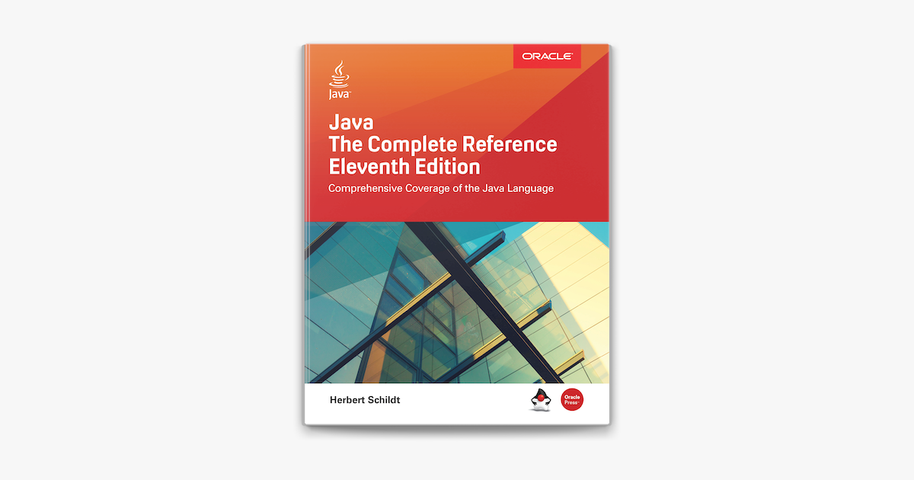

This repository contains solutions and examples for the exercises from the book described below.

## The Java Complete Reference
#### Eleventh Edition

Comprehensive Coverage of the Java Language
Herbert Schildt\
Oracle Press

## Contents

| # | Chapter | Status |
| --- | --- | --- | 
| 1 | [An Overview of Java](./src/main/java/com/guide/c1) | :white_large_square : |
